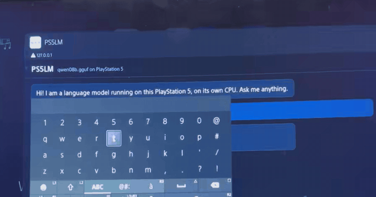

# PS5LM

**llama.cpp on a jailbroken PlayStation 5.** Run any GGUF language model on the console itself, first on its Zen 2 CPU, then on its GPU.

<p align="center">
  <a href="https://ps5lm.cobanov.dev"></a>
</p>

<p align="center"><b><a href="https://ps5lm.cobanov.dev">ps5lm.cobanov.dev</a></b>: the full demo video and how it works</p>

The first target is **Qwen 3.8** (27B, hybrid Gated DeltaNet attention), the newest open Qwen. No one has run it on a PS5 yet.

> **Status:** v0.1 is out. One payload, `ps5lm.elf`, opens a model library in the PS5's browser: download a model on the console, run it, chat. Small models for now (up to 1.6 GB, Qwen3.5 0.8B and 2B). See [docs/ROADMAP.md](docs/ROADMAP.md) and [docs/CONSOLE.md](docs/CONSOLE.md).

## Install

You need a PS5 you own on firmware 7.00 to 13.60, jailbroken, with a payload loader (Payload Manager from WebKit Autoloader, or elfldr on port 9021).

**From Payload Manager**, which also brings updates:

1. *Settings*: turn on **Multiple Payload Sources**.
2. Add the source `https://ps5lm.cobanov.dev/payloads.json`.
3. Install **PS5LM** from the list and load it.

**Or by hand**: download `ps5lm.elf` from the [latest release](https://github.com/cobanov/PS5LM/releases/latest) and load it like any payload (upload it in Payload Manager, or send it to an ELF loader on port 9021).

Once it runs, the PS5's browser opens the PS5LM library. Press **Download** on a model, then **Run**, then **Open chat**. Type with the DualSense.

The library also works from a phone or computer on the same network at `http://<console IP>:8082`, and the chat at port 8081 speaks the OpenAI API. Models are stored in `/data/PS5LM/models`; a GGUF copied there over FTP shows up too.

Limits for now: a payload can only keep about 1.6 GB of model locked in memory without starving the home screen, so the catalog has Qwen3.5 0.8B (13 to 21 tok/s) and Qwen3.5 2B (about 9 tok/s). Bigger models need a native app ([#4](https://github.com/cobanov/PS5LM/issues/4)).

## Why llama.cpp

Earlier PS5 LLM work hand-writes GPU kernels for one model at a time. PS5LM ports llama.cpp itself, so every architecture and every quantization llama.cpp supports comes along: Qwen, Llama, Mistral, Gemma, from 1-bit to 8-bit. Qwen 3.8's smallest open model is 27B, and only the 2 to 3 bit quants fit in the console's memory, which llama.cpp already has.

## Layout

| Path | What |
|---|---|
| `third_party/llama.cpp` | upstream llama.cpp, pinned as a submodule |
| `ps5/compat` | the few libc functions the console lacks |
| `patches/` | PS5 changes to llama.cpp's source, kept small |
| `probes/` | `memprobe` and `threadprobe`: what a payload gets on the console |
| `scripts/` | SDK setup, the llama.cpp cross build, sending payloads |
| `docs/` | [roadmap](docs/ROADMAP.md), [models that fit](docs/MODELS.md), [porting notes](docs/PORTING.md), [research](docs/RESEARCH.md) |

## Building from source

Needs the [ps5-payload-dev SDK](https://github.com/ps5-payload-dev/sdk) and a host LLVM.

```sh
# macOS
brew install llvm@21 lld socat cmake ninja
# Debian / Ubuntu
sudo apt install clang-18 lld-18 socat cmake ninja-build

git clone --recursive https://github.com/cobanov/PS5LM
cd PS5LM
scripts/setup-sdk.sh
source scripts/env.sh

make -C probes/memprobe          # Phase 0 probe
scripts/build-llama.sh           # llama-cli, llama-server, llama-bench for the PS5
```

## Running on the console

You need a PS5 you own on firmware 7.00 to 13.60, jailbroken, with an ELF loader listening on port 9021 ([elfldr](https://github.com/ps5-payload-dev/elfldr)).

```sh
scripts/host-relapse.sh          # serves the Relapse exploit page; open it in the PS5's browser
export PS5_HOST=192.168.1.50     # your console
scripts/console-setup.sh         # FTP, kernel log and shell payloads
scripts/send.sh probes/memprobe/memprobe.elf
```

The probe streams its results back and also writes them to `/data/PS5LM/memprobe.txt` on the console.

With [ftpsrv](https://github.com/ps5-payload-dev/ftpsrv) running too (port 2121), `scripts/run.sh` uploads a llama.cpp tool and starts it with arguments:

```sh
# copy a model to /data/PS5LM/models first (FTP or USB)
scripts/run.sh llama-cli -m /data/PS5LM/models/model.gguf -p "Hello from a PS5" -n 64
scripts/run.sh llama-server -m /data/PS5LM/models/model.gguf --host 0.0.0.0 --port 8081
```

## Credits

- [llama.cpp / ggml](https://github.com/ggml-org/llama.cpp), which does the actual work.
- [ps5-payload-dev](https://github.com/ps5-payload-dev) (John Törnblom) for the SDK and the ELF loader.
- [PS5SX2](https://github.com/Swordpdf/PS5SX2), [ProsperoAI](https://github.com/blackbearreloaded/ProsperoAI) and [PS5_Vulkan](https://github.com/mihawk-99/PS5_Vulkan), whose notes on the console's memory and GPU this project leans on.

## Licence

GPL-3.0-or-later, see [LICENSE](LICENSE). llama.cpp keeps its MIT licence. No Sony SDK files, keys, firmware or model weights are in this repository.

PS5LM is not affiliated with Sony Interactive Entertainment or Alibaba. "PlayStation" and "PS5" are trademarks of Sony Interactive Entertainment.
